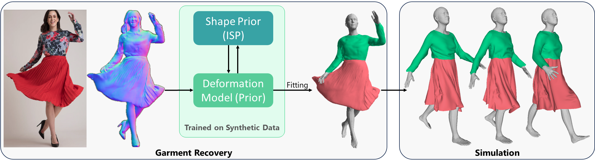

# Garment Recovery with Shape and Deformation Priors
<p align="center"></p>

This is the repo for [**Garment Recovery with Shape and Deformation Priors**](https://liren2515.github.io/page/prior/prior.html).

## Setup:
Download checkpoints from [here](https://drive.google.com/file/d/1Zhr93ejWGobqDnJjE-P95ssNTDYSFNXS/view?usp=sharing), and put `*.pth` at `./checkpoints`.

Download and extract the SMPL model from http://smplify.is.tue.mpg.de/, and place `basicModel_f_lbs_10_207_0_v1.0.0.pkl` and `basicModel_neutral_lbs_10_207_0_v1.0.0.pkl` in the folder of `./smpl_pytorch`.

## Install
The code is implemented with python 3.8, torch 2.0.1 and cuda 11.8 (other versions usually work as well).

Other dependencies include `trimesh`, `pytorch3D`, `scipy`.

## Inference
For garment generation:
```
python infer_isp.py --which tee/pants/skirt --save_path tmp --save_name skirt --res 256 --idx_G 0
```

For layering inference:
```
python infer_layering.py
```

## Fitting
For fitting ISP to 3D garment mesh in rest pose:
```
python fitting_3D_mesh.py --which tee/pants/skirt --save_path tmp --save_name skirt-fit --res 256
```

For fitting ISP to images:
```
python fitting_image.py
```
The example files are under `./extra-data/fitting-sample/`, including the segmentation mask `mask.png` and the SMPL parameters `mocap.pkl`. We use [Self-Correction-Human-Parsing](https://github.com/GoGoDuck912/Self-Correction-Human-Parsing) to produce garment masks, and [frankmocap](https://github.com/facebookresearch/frankmocap) to estimate SMPL parameters.

## Citation
If you find our work useful, please cite it as:
```
@inproceedings{li2024garment,
  author = {Li, Ren and Dumery, Corentin and Guillard, Benoit and Fua, Pascal},
  title = {{Garment Recovery with Shape and Deformation Priors}},
  booktitle = {Proceedings of the IEEE/CVF Conference on Computer Vision and Pattern Recognition},
  year = {2024}
}
```
